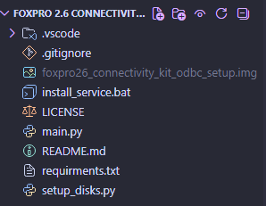

# FoxPro 2.6 Connectivity Kit ODBC Setup Disk Game Launcher Because It Fell Under My Desk

## What is this?

So I saw a youtube video where someone was using another app (maybe custom, IDK) to launch and stop games with floppy disks. So I made my own.

### Which floppy disk reader did you use?

[This one](https://a.co/d/06b7iXoY). I used some random floppy disks I had lying around, windows 11 still supports floppy disks, and I think linux also does, if your wondering (this works on windows 11, what I'm using)

## What launchers does it support?

Steam and Playnite so far, maybe I'll add more at some point (really just like system tasks)

## I looked through the code and, WTF is this TRASH!?

Yeah, I wanted cancel logic and retry logic, didn't go super well, but it works! (sarcastic)

Also, if you look through commit history, you can see the commit messages getting worse (this is when I was making the setup_disks.py program, if you look at it, you'll see. Along with a bad headache you'll probably get)

## What's this name?

Epic, IKR.

Lore explanation:

So I was about to make the program, I was grabbing all my old floppy disks and one fell to like on the radiator behind/under my desk, I felt that I must pick it up and I can't just leave it there so I finally grabbed it out. The disk is a (I think clone of) the "FoxPro 2.6 Connectivity Kit ODBC Setup Disk." I thought the name was funny so, I named the project after it. After looking online, this disk is completley gone, you can't download it AT ALL, as far as I could find, only newer versions. I made a copy of it, and it is now preserved for hopefully forever. The file is in this project folder but, due to copyright stuff, I must put it in the gitignore file. Though at least it's probably one of the longest project names ever! (my vscode top bar is insane) 

## foxpro26_connectivity_kit_odbc_setup.img is really there?

Yes, here's proof:



## What theme is that?

Catppuccin Mocha, I also [this animation thing](https://marketplace.visualstudio.com/items?itemName=BrandonKirbyson.vscode-animations)

## Why did you make this?

I get bored

## Theres a bug!

I don't care

## How do I install this

1. Go on Google and search "Free FoxPro 2.6 Connectivity Kit ODBC Setup Disk Game Launcher Because It Fell Under My Desk APK download for iPhone 2026 working"

2. Download the one that has the most flags on Virustotal

I'm kidding, don't do that, the instruction's I am about to provide are complex so be ready,

1. Download project sourcecode (ooh scary, no releases, OH NO WHAT WILL I EVER DO!!!! Lucky you, this is python, you don't need to compile)

2. Have a working python.exe and pythonw.exe on path + pip

3. Open project folder and run this command

```bash
pip install -r requirments.txt
```

4. Try running main.py, if it crashes, ask AI to help you until it doesn't, if it just does nothing and stays running, close it with CTRL+C (probably) and then you can run the install-service.bat file to set it up, you need to find it in task scheduler and run it or log out and log back in (I think) for it to start.

5. Run setup_disks.py to set the app up if you want, otherwise, do it manually

## Where's the config folder?

```
%APPDATA%\FP26CKOSDGLBIFUMD
```

Edit library.toml

## What is that Appdata folder name?

It stands for "FoxPro 2.6 Connectivity Kit ODBC Setup Disk Game Launcher Because It Fell Under My Desk"

## Linux support?

Not until I move over to linux (if I do), I might soon but probably not, also when I do, windows support might drop

## Mac support?

Never! PORT IT YOURSELF!!!

## Can I have a config example?

Here:

```toml
[disks.DISKIDHERE]
app_type = "steam"
app = "620"
process = "portal2.exe"

[disks.DISKIDHERE]
app_type = "steam"
app = "400"
process = "hl2.exe"
```

Replace DISKIDHERE with the ID of the floppy

## Whats a disk ID?

Claude came up with it, not really sure, but it comes from the time that the floppy was formatted, you can get it by the option in setup-disks.py

## What's the pause file in the config folder for?

When setting up a disk, it could run the game for it and be annoying during the setup process, when this file exists, it pauses the game running part of the main program until it's deleted. If you want to pause it yourself, create this file (no extension, no text needs to be in it)

```
%APPDATA%\FP26CKOSDGLBIFUMD\pause
```

This will get deleted when you finish (or cancel) setting up a disk. When you run setup-disks.py and this exists, it will also ask you if you want to delete it

## Why is this readme so unorganized?

Because I just wrote the things that came to my head and don't feel like organizing it

## Other random questions

### Why do you use selfhosted Gitea?

Why not? Github added dumb AI stuff that I don't like and it's just a fun homeserver project.

### What app did you make this markdown in?

[MarkText](https://github.com/marktext/marktext), just got it, it's neat

### How did you get https?

[Caddy](https://caddyserver.com/), simple way to get https, just works, neat